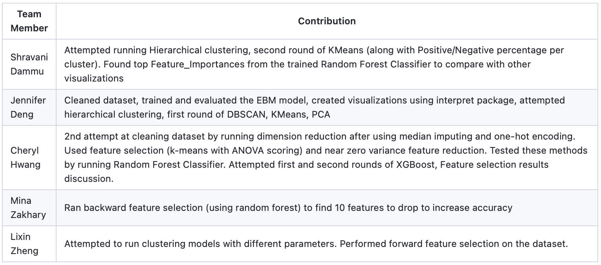

# predicting-patient-mortality

## Introduction/Background 
The need for intensive care unit (ICU) patient care expands each year (3). One of the greatest issues that ICU clinicians face is treating and monitoring acutely ill patients (3).  
## Problem Definition
Patients in the ICU must be treated based on the level of risk of mortality for the patient, but there is no universal way to test this between patients with different ailments. We will create a model that predicts mortality in ICU patients by assessing their level III APACHE score for various diagnostic bodies. With this model, clinicians will have a single metric to use to assess risk levels. 
## Problem Definition
This dataset includes the electronic health record data of 250,000 patients from the Australian and New Zealand Intensive Care Society Adult Patient Database (ANZICS-APD) and 130,000 patients from the US eICU Collaborative Research Database (eICU-CRD) (1) summarized by APACHE (Acute Physiology and Chronic Health Evaluation) data grouped by diagnosis bodies (e.g., cardiovascular, gastrointestinal, etc.). The data collected reflects the patient’s first 24 hours stay in the ICU and is labelled by patient mortality. 

Prior to data cleaning, there are 91,713 entries, each corresponding to a unique patient encounter, and 186 features. 
## Methods 
### Initial Data Exploration

These visualizations were created with the IntrepretML Package in order to assess the data at a high level. 


#### *Figure 1*. Age Distribution Plot. 

This plot shows the age distribution of all the patients in the dataset. The dataset is skewed left with the majority of the patients >50 years old. This plot also shows the imbalance of labels. The majority of positive labels (marking patient expired) is with the majority of the patients (>50 years), which is expected.


#### *Figure 2*. Label Distribution.

Our dataset has a 10:1 imbalance, favoring non-expired patients (marked as 0). Details on how this is accounted for is expanded upon in the next section.

### Data Cleaning


We imputed missing values for continuous features with the median. For categorical variables, we imputed missing values with the label “Missing” and one-hot encoded the features. One-hot encoding led to the number of features increasing from 186 to 238. We chose not to use an ordinal encoding, as the categorical variables have no ranking or hierarchical relationship between each other.  


To account for the 10:1 data imbalance (*Figure 2*), we used a combination of under- and over-sampling with the package imblearn. First, we defined an oversampling strategy with 0.40; this means that in the original set of 0: 83798 and 1: 7915, we oversample the number of minority instances to achieve 40% of the majority class. However, the danger with oversampling the minority class is that we may increase the likelihood of overfitting, the phenomenon where we observe low training error but high testing error. To mitigate this error, we then undersampled the data with a strategy of 0.70.  This means that 70% of the minority instances should make up the number of majority instances. In the end, our Counter dict turned out like this: 

```
Counter({0: 83798, 1: 7915}) # prior to any sampling 

Counter({0: 83798, 1: 33519}) # after oversampling 

Counter({0: 47884, 1: 33519}) # after undersampling 
```

However, we observed a decrease in model performance for EBM after under- and over-sampling, and no appreciable effect on Random Forest performance. 


### Feature Selection

We threw out **too-dense features** such as “patient id”, “encounter id”, and “hospital id”; these features are merely unique identifiers and have no predictive value. The function df.nunique() allowed us to see the number of unique values per feature. We removed the feature “hospital death” from the feature set and made that the label. Additionally, we threw out the features that are an analog to the label. These features include “apache_4a_hospital_death_prob” and “apache_4a_icu_death_prob”, which are probabilities of mortality for the patient. In total, this brought the number of features down from 238 to 233.  


We attempted **PCA** with 50 components, but we observed a decrease in model performance. 
After normalizing the data, we also attempted to feature select using selecting k means based on ANOVA (analysis of variance). This was done on the training data. As a result, the ten best features were selected. These features were:
```
['gcs_eyes_apache' 'gcs_motor_apache' 'gcs_verbal_apache' 'ventilated_apache' 'd1_spo2_min' 'd1_sysbp_min' 'd1_sysbp_noninvasive_min' 'd1_temp_min' 'd1_lactate_max' 'd1_lactate_min']
```


We also attempted to **feature select** using the near zero variance method after normalizing the data. Using a 0.005 threshold, meaning that all features with less than 0.005 variance were removed, we were left with 208 features.  


Feature selection from scikit-learn's **forward feature selection** (on a smaller subset) gives that the top 15 features are:
```
['elective_surgery' 'readmission_status' 'arf_apache' 'gcs_unable_apache' 'ph_apache' 'urineoutput_apache' 'd1_albumin_min' 'd1_hemaglobin_min' 'd1_lactate_max' 'd1_arterial_ph_max' 'aids' 'cirrhosis' 'lymphoma' 
 'ethnicity_Native American' 'icu_type_SICU']
 ```
 
 In addition, we used Random Forest Classifier feature_importances in order to analyze other top features determined important by the model. These top 20 features are:  
 ```
 [ ‘d1_lactate_max’ ‘d1_lactate_min’ ‘gcs_eyes_apache’ ‘d1_sysbp_min’ ‘d1_arterial_ph_min’ ‘d1_sysbp_noninvasive_min’ ‘temp_apache’ ‘d1_spo2_min’ ‘d1_heartrate_min’ ‘apache_3j_diagnosis’ ‘gcs_motor_apache’ ‘d1_mbp_min’ ‘d1_bun_min’ ‘d1_temp_max’ ‘ventilated_apache’ ‘d1_temp_min’ ‘d1_arterial_ph_max’  ‘apache_2_diagnosis’ ‘d1_mbp_noninvasive_min’ ‘heart_rate_apache’ ] 
 ```
 
We captured the results of these methods and their corresponding models in *Table 1*. 
### Unsupervised Learning

We tried several unsupervised learning methods to help visualize the data given. Our initial proposal was to use hierarchical clustering. However, with further research, we saw that hierarchical clustering is not suitable for large imbalanced datasets. With a dataset of 232 features after initial data cleaning, as well as the data imbalance, we decided to focus on PCA, K-means, and DBscan to cluster our data.  

#### K-means clustering

We first applied Kmeans onto the dataset without any feature reduction. We graphed the elbow graph to determine that 5 was the optimal number of clusters. When plotting these 5 clustering, we see all the clusters lie in the same area, with cluster 4 being the only cluster with a slightly smaller range. To analyze further, we found the positive and negative proportions of each cluster. Here, the positive labels represent patients who have expired. With this, the data imbalance became clearer, as we see that all but cluster 4, have less than 15% of positive data points (*Figure 3*). The label distribution for each cluster is shown in Figure 4.  


#### *Figure 3*. Initial K-means Distribution and Elbow Graph.


#### *Figure 4*.  Label distribution for clusters

Shows the percentage of label distribution for each of the 4 clusters, 5 including the noise cluster. C(0), the largest cluster, has a distribution relatively similar to the entire dataset. C(-1), the noise cluster, and C1 have a slightly more balanced distribution. C3 has a majority of patients who expired. This indicates that this cluster may be of interest. 

Cluster analysis was conducted to see which features would be most important for Cluster 3. Granted, there were only 29 patients in this cluster, so results should not be generalized. The ranking is as follows: 


#### *Table 1*. Shows the number of patients per cluster from DBSCAN. eps = 0.1, min_pts = 30.  


#### *Figure 5*.  Pairwise interaction scatter plots show the relationship between pairs of variables, color-coded by label.

As suspected, more positive labels appear with higher ranges of lactate. There is also an observed decrease in pH as lactate increases, and the number of positive labels increase. Accordingly, systolic blood pressure also decreases with an increase in positive labels.

We also applied K-means to two reduced datasets. We first applied K-means on the dataset that removed features with variances of .003 and .005. This in total, removed 44 features, resulting in a dataset with 208 features. However, this reduction still resulted in similar results as the past dataset. The only difference seen could be the range of area the 4th cluster covers is slightly larger than that of the past round k-means (*Figure 5*).  


#### *Figure 6*. K-means Distribution on Dimension Reduced Dataset (Low Variance)

We then applied K-means to the dataset that went through feature reduction. However, this provided for some extremely abnormal results where the data was evenly spaced out. In addition, by looking at the label proportions, we see K-means clustered the data into either all positives or all negative labelled data (*Figure 6*).  


#### *Figure 8*. Proportions on Data (No Feature Reduction) 
Visualization of the label distribution from the KMeans with n_clusters=5 on the data without any feature reduction. Figure y has the percentages of patient survivals (0 Label) and deaths (1 Label), along with number of patients per cluster. 
Cluster Analysis on these 5 clusters shows the 10 most important features per cluster. All clusters had ventilated_apache and gcs_motor_apache as important features. Other features that were seen in most of these clusters include gcs_eyes_apache, gcs_verbal_apache, and age. 


The top 10 most important features for C0 are as follows: 


#### *Figure 9*. Proportions on Data (Removed Features of 0.005 variance):
Visualization of the label distribution from the KMeans with n_clusters=5 on the data with feature reduction (features with <.005 variance removed). Figure y has the percentages of patient survivals (0 Label) and deaths (1 Label), along with number of patients per cluster. 
From this round of KMeans Clustering, we don’t see stark difference in cluster distribution, since all clusters still have a relatively uneven label distribution.  


#### *Figure 10*. Proportions on Data (Top 10 features after Feature Reduction) 
Visualization of the label distribution from the KMeans with n_clusters=5 on the data with feature reduction (top ten features). Figure y has the percentages of patient survivals (0 Label) and deaths (1 Label), along with number of patients per cluster. 
In this last round of KMeans on the feature reduced dataset, we a slight difference in the label distribution. Specifically, C4 has a relatively balanced label distribution, albeit leaning towards more patient survival.  


### Supervised Learning
We attempted 3 models: Explainable Boosted Machine (EBM), XGBoost, and Random Forest. The following table summarizes the model performances and parameters. 


## Results and Discussion 

### Model Performance Metrics

For which metrics are most relevant, we decided upon area under the ROC curve after speaking with our mentor. We included both AUC ROC score and accuracy in *Table 2*.

Below is the baseline ROC, bolded in *Table 2*.


#### *Figure 11*. The ROC for the baseline model.


#### *Figure 7*. This is an example of a global explanation of the feature age and how it affects the EBM model’s prediction. When the line is above the x-axis, this corresponds to a positive contribution to the prediction, leading to a higher likelihood of a positive label. The global explanation shows what’s expected: the older a patient is, the more likely they are to expire in the ICU. What’s interesting is a spike at around age 65. This indicates that patients 65 or older have a higher likelihood of mortality. 


### Model Performances and Parameters


#### *Table 2. Displays model performance based on parameters.*


#### *Figure 12. This figure shows the tradeoff between model train time and accuracy. The legend shows the layout of each data label and the green star marks our benchmark model. One EBM model (train time of 17 minutes) is not shown on this graph because it did not finish running. *

### K-fold Cross Validation


#### *Table 3*. K-Folds Cross Validation for Each Model Configuration Results


#### *Figure 13*. K-Folds Cross Validation Box and Whisker Plot. ROC-AUC vs. Configuration

### Feature Selection Results

We tried 4 different forms of feature selection: k means ANOVA, forward feature selection, backward feature selection, and Random Forest Classifier’s (RFC) feature_importances. 


A feature selected from k means ANOVA, RFC feature_importances, and forward selections is d1_lactate_max, which is the highest concentration of lactate in the patient’s serum or plasma during their first 24 hour stay. Lactate concentration in plasma is directly correlated with tissue hypoxia, which is a lack of oxygen in the tissue and very life-threatening. This is an interesting feature to pursue.


Kmeans ANOVA, RFC feature_importances, and forward selection all pulled out lab vitals (marked by d1). It may be worthwhile to pull out these features specifically and rank their relative importances.  


The k means-based feature selection pulled out three gcs values are integer scores that specify a patient’s APACHE score on the Glasgow Coma scale, [gcs_eyes_apache' 'gcs_motor_apache' 'gcs_verbal_apache' ]. RFC feature_importances also pulled out gcs_eyes_apache. Eyes, motor, and verbal APACHE are the components of this test and together they assess a patient’s consciousness. It is expected that if these scores are related that they would have similar ANOVA scores. As these scores are related, it might be valuable to test their collinearity, and, if highly correlated, combine these three scores moving forward. 


The forward feature selection and RFC feature_importances pulled out a few more Apache values. The only one in common is urineout_apache, which is the total urine expelled during the first 24 hours of stay. The amount of urine expelled is correlated with bodily failure, where less urine means higher failure. These two methods also pulled out some binary features that are expected, such as aids, cirrhosis, lymphoma, and readmission status. The only binary feature that was pulled out and unexpected is 'ethnicity_Native American'. This may be because there is a small total of this feature and results were skewed.  


The backward feature selection ran with an effort to drop a total of 10 features, but it was found out that dropping just 4 features yields the highest ROC AUC. The features dropped include 'h1_diasbp_max', 'h1_glucose_min', and 'icu_type_SICU'. 

### Next Steps
Moving forward, we want to continue to pursue and combine our various methods of feature selection. In addition, we will also try more feature reduced data on K-Means, in order to find more optimal clustering distributions. We are also planning on creating a neural network model.

## Proposed Timeline
[Machine Learning Gantt Chart_Phase2.xlsx](https://gtvault-my.sharepoint.com/:x:/g/personal/jdeng61_gatech_edu/EefVxgdR04FJi-TnycJe8McB9epcDEmSAEflLO74bSiccw?e=jR6yYZ)


## Contribution Table for Midtern


## Contribution Table for Final


### References 
1. Raffa, Jesse & Johnson, Alistair & Celi, Leo & Pollard, Tom & Pilcher, David & Badawi, Omar. (2019). 33: THE GLOBAL OPEN SOURCE SEVERITY OF ILLNESS SCORE (GOSSIS). Critical Care Medicine. 47. 17. 10.1097/01.ccm.0000550825.30295.dd. 
2. Adhikari, N. K., Fowler, R. A., Bhagwanjee, S., & Rubenfeld, G. D. (2010). Critical care and the global burden of critical illness in adults. Lancet (London, England), 376(9749), 1339–1346. https://doi.org/10.1016/S0140-6736(10)60446-1 
3. John C. Marshall, Laura Bosco, Neill K. Adhikari, Bronwen Connolly, Janet V. Diaz, Todd Dorman, Robert A. Fowler, Geert Meyfroidt, Satoshi Nakagawa, Paolo Pelosi, Jean-Louis Vincent, Kathleen Vollman, Janice Zimmerman, What is an intensive care unit? A report of the task force of the World Federation of Societies of Intensive and Critical Care Medicine. Journal of Critical Care. Volume 37, 2017. Pages 270-276. ISSN 0883-9441. https://doi.org/10.1016/j.jcrc.2016.07.015. 
